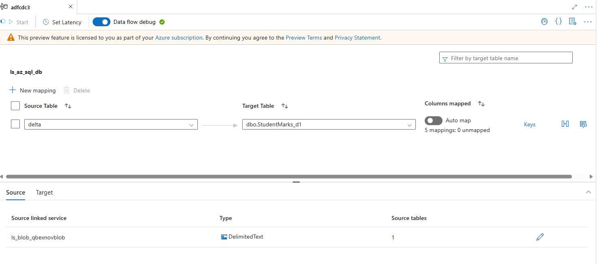

# CDC BLOB to SQL


### Step 1: Create Table in SQL Server
```SQL
CREATE TABLE StudentMarks (
    student_id INT,
    student_name VARCHAR(255),
    student_marks FLOAT,
    class INT,
    school VARCHAR(255)
);
```

### Step 2: Assume file is available in BLOB container

### Step 3: Configure CDC resource

#### Step 3.1: 

